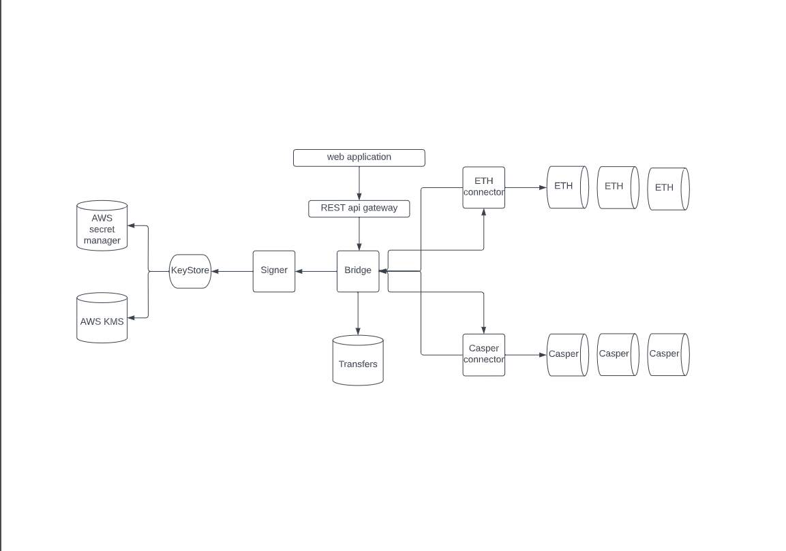

This project facilitate communication between blockchains through the transfer of information and assets.
It consists of multiple modular swap-in components and supports an increasing number of composable applications built by numerous teams.


### Architecture overview



#### **Off-Chain components:**

- **Bridge**: communication mediator between all other microservices. Orchestrator of our centralized monolith. Also Bridge is responsible for saving transactions to database.

- **Connectors**:  each supported blockchain should have smart contract deployed and connector, that will communicate with this smart contract. Main responsibility on connector is to observe FundsIn transaction and send FundsOut.

- **Signer**: signs all transactions.

- **Gateway**: REST api gateway that allows any frontend to use bridge functionality.

#### **On-Chain components:**

- **Bridge smart contracts**: Primary ecosystem contracts. These are the contracts which the Connectors observe and which fundamentally allow for cross-chain communication. Each supported blockchain should have such smart contract to be deployed.


### Bridge

[documentation](./boosty-bridge/README.md)

### Connectors

#### Structure

This folder contains all bridge supported networks and interaction with them, which divided into independent microservices (we call them connectors).

All microservices have generic interface, and every of them implements it.

So networks logic located in network named folders (casper, emv, etc).

Since connectors have the same structure we could define one server implementation, which will cover all needed implementation.

Server you could find in `server` folder.

#### Connectors functionality    

In short, connectors have 3 main tasks: generating signatures, sending  transactions and reading events after them. Connectors do NOT analyze, do NOT store data that comes to send transactions or read from events  after transactions, connectors only convert data into the appropriate  types that are needed to perform actions. The connectors are as  autonomous as possible, that is, having 2 connectors connected to the  bridge, you can already exchange your funds. They are also resistant to  reboots/disconnections from the bridge, because after the restoration of work, they will constantly try to reconnect, and after they succeed,  they will start reading events from the place where we stopped. Also, if the reconnection takes a long time for some reason, the user can cancel the operation at any time and get back the money from the contract for  the deposit. 

Let's take a look on proto file where we could understand general data flow between connector and bridge itself.

    ```protobuf    
    service Connector {     
        // Return metadata of the network this connector provides.     
        rpc Metadata(google.protobuf.Empty) returns (NetworkMetadata);     
        // Return tokens known by this connector.     
        rpc KnownTokens(google.protobuf.Empty) returns (ConnectorTokens); 
        
        // Initiate event stream from the network.     
        rpc EventStream(EventsRequest) returns (stream Event);     
        // Initiate outbound bridge transaction.     
        rpc BridgeOut(TokenOutRequest) returns (TokenOutResponse);     
        // Estimate a potential transfer.     
        rpc EstimateTransfer(EstimateTransferRequest) returns (EstimateTransferResponse);     
        
        // Return signature for user to send bridgeIn transaction.     
        rpc BridgeInSignature(BridgeInSignatureWithNonceRequest) returns (BridgeInSignatureResponse);     
        // Return signature for user to return funds.     
        rpc CancelSignature(CancelSignatureRequest) returns (CancelSignatureResponse);    
    }   
    ```

#### **EVM connector**

Allows to interact with EVM-compatible blockchains.

Let's go through every method to understand how everything works.   

Some methods are pretty simple, they just takes some values from config,  and put them into output structure, f.e. `Metadata`

##### ReadEvents  

###### Reading old events.    

​    If we start from scratch and client does not have any events we skip reading events.    On the other hand if client already has some events. We will read small chunks would be more appropriate,    because logs reading/parsing is time-consuming operation.    
   Organization of reading logic looks like this.

```go
 // readEventsFromBlock reads node events in a given interval of blocks and notifies subscribers.    
func (service *Service) readEventsFromBlock(ctx context.Context, fromBlock, toBlock uint64) error {    	
    var lastProcessedBlock = fromBlock    	
    for {     
        switch {
            case lastProcessedBlock < toBlock:
            err := service.readOldEvents(ctx, lastProcessedBlock, lastProcessedBlock+listeningLimit)     
            if err != nil {
                return Error.Wrap(err)
            }     
            case lastProcessedBlock >= toBlock:
                return service.readOldEvents(ctx, lastProcessedBlock, toBlock)     
                default:     return nil
        }
            
        lastProcessedBlock += listeningLimit
    }
}  
```

parsing events which have been read.

```go 
for _, log := range logs {     
    // check is func need to be closed because of app/stream context.     
    select {
        case <-service.gctx.Done():
        	return nil
        case <-ctx.Done():
        	return nil
        default:
        }
    event, err := parseLog(service.instance, log, service.config.EventsFundIn, service.config.EventsFundOut)
    if err != nil {
        return Error.Wrap(err)
    }
    service.Notify(ctx, event)
}
```

###### Subscribe brand-new events

 For live events reading we use web-socket  node client, logic is the same as for reading old events, we form  topics, then query, and initiate events streaming from node, new events  will code using channel.

```go
 topics := make([]common.Hash, 0)
    topics = append(topics, service.config.EventsFundIn, service.config.EventsFundOut)

    query := ethereum.FilterQuery{
        Addresses: []common.Address{service.config.BridgeContractAddress},
        Topics:    [][]common.Hash{topics},
    }

    logsCh := make(chan types.Log)
    subscriptions, err := service.wsEthClient.SubscribeFilterLogs(ctx, query, logsCh)
    if err != nil {
        return Error.Wrap(err)
    }
```

##### Logs parsing

```go
switch log.Topics[0] {
	case fundInEventHash:
		fundIn, err := instance.ParseBridgeFundsIn(log)
		if err != nil {
			return chains.EventVariant{}, Error.Wrap(err)
		}

		txInfo := chains.TransactionInfo{
			Hash:        fundIn.Raw.TxHash.Bytes(),
			BlockNumber: fundIn.Raw.BlockNumber,
			Sender:      fundIn.Raw.Address.Bytes(),
		}

		event := chains.EventVariant{
			Type: chains.EventTypeIn,
			EventFundsIn: chains.EventFundsIn{
				From: fundIn.Sender.Bytes(),
				To: networks.Address{
					NetworkName: fundIn.DestinationChain,
					Address:     fundIn.DestinationAddress,
				},
				Amount: fundIn.Amount.String(),
				Token:  fundIn.Token.Bytes(),
				Tx:     txInfo,
			},
		}

		return event, nil
	}


```

In log object we receive topic of event, and using this topic we could  determine event type, and parse it to generated from smart contract  structure and work with it.

##### Notifying API layer with new events

For notifying we use publisher-subscriber pattern, so when stream initiates we add new subscriber to slice.

```go
func (service *Service) AddEventSubscriber() chains.EventSubscriber {
	subscriber := chains.EventSubscriber{
		ID:         uuid.New(),
		EventsChan: make(chan chains.EventVariant),
	}

	service.mutex.Lock()
	defer service.mutex.Unlock()
	service.eventSubscribers = append(service.eventSubscribers, subscriber)

	return subscriber
}
```

Then when new events appear we call `service.Notify` to send new event for all subscribers

```go
// Notify notifies all subscribers with events.
func (service *Service) Notify(ctx context.Context, event chains.EventVariant) {
	service.mutex.Lock()
	defer service.mutex.Unlock()

	for _, subscriber := range service.eventSubscribers {
		select {
		case <-service.gctx.Done():
			return
		case <-ctx.Done():
			return
		default:
			subscriber.NotifyWithEvent(event)
		}
	}
}
```

#### Casper connector

Casper allows to interact with Casper and Casper-test networks.

##### ReadEvents

###### Reading old events.

If we start from scratch and client does not have any events we skip old reading events. On the other hand if client already has some events -  we will read them by block number. Since Casper has not saved the  history of events for a long time - we read them from blocks.

###### Subscribe brand-new events.

For live events reading we use a simple get request that will broadcast events from node to us

```go
  var body io.Reader
	req, err := http.NewRequest(http.MethodGet, service.config.EventNodeAddress, body)
	if err != nil {
		return ErrConnector.Wrap(err)
	}

	resp, err := service.events.Do(req)
	if err != nil {
		return ErrConnector.Wrap(err)
	}
	
	for {
		reader := bufio.NewReader(resp.Body)
		rawBody, err := reader.ReadBytes('\n')
		if err != nil {
			return ErrConnector.Wrap(err)
		}

		rawBody = []byte(strings.Replace(string(rawBody), "data:", "", 1))

		// parsing.
		...
	}
```

###### Logs parsing

```go
var eventFunds chains.EventVariant
	switch eventType {
	case chains.EventTypeIn.Int():
		eventFunds = chains.EventVariant{
			Type: chains.EventType(eventType),
			EventFundsIn: chains.EventFundsIn{
				From: userWalletAddress,
				To: networks.Address{
					NetworkName: chainName,
					Address:     chainAddress,
				},
				Amount: amountStr,
				Token:  tokenContractAddress,
				Tx:     transactionInfo,
			},
		}
	case chains.EventTypeOut.Int():
		eventFunds = chains.EventVariant{
			Type: chains.EventType(eventType),
			EventFundsOut: chains.EventFundsOut{
				From: networks.Address{
					NetworkName: chainName,
					Address:     chainAddress,
				},
				To:     userWalletAddress,
				Amount: amountStr,
				Token:  tokenContractAddress,
				Tx:     transactionInfo,
			},
		}
	default:
		return chains.EventVariant{}, ErrConnector.New("invalid event type")
	}
```

In log object we receive type of event, and using this type we could parse it to the desired structure.

###### BridgeOut

It is a method that sends users funds equivalent to what they have  contributed to the selected network. In this method, we convert the  parameters into a type suitable for Casper, and make a transaction from  our system address.

```go
args := map[string]sdk.Value{
		"token_contract": {
			IsOptional:  false,
			Tag:         types.CLTypeByteArray,
			StringBytes: hex.EncodeToString(tokenContractBytes),
		},
		"amount": {
			Tag:         types.CLTypeU256,
			IsOptional:  false,
			StringBytes: hex.EncodeToString(amountBytes),
		},
		"source_chain": {
			Tag:         types.CLTypeString,
			IsOptional:  false,
			StringBytes: hex.EncodeToString(sourceChainBytes),
		},
		"source_address": {
			Tag:         types.CLTypeString,
			IsOptional:  false,
			StringBytes: hex.EncodeToString(sourceAddressBytes),
		},
		"recipient": {
			Tag:         types.CLTypeKey,
			IsOptional:  false,
			StringBytes: hex.EncodeToString(recipientBytes),
		},
	}

	keyOrder := []string{
		"token_contract",
		"amount",
		"source_chain",
		"source_address",
		"recipient",
	}
	runtimeArgs := sdk.NewRunTimeArgs(args, keyOrder)

	contractHexBytes, err := hex.DecodeString(service.config.BridgeContractPackageHash)
	if err != nil {
		return nil, ErrConnector.Wrap(err)
	}

	var contractHashBytes [32]byte
	copy(contractHashBytes[:], contractHexBytes)
	session := sdk.NewStoredContractByHash(contractHashBytes, "bridge_out", *runtimeArgs)

	deploy := sdk.MakeDeploy(deployParams, payment, session)

	data, err := json.Marshal(*deploy)
	if err != nil {
		return nil, ErrConnector.Wrap(err)
	}

	reqSign := chains.SignRequest{
		NetworkId: networks.TypeCasper,
		Data:      data,
	}
	signature, err := service.bridge.Sign(ctx, reqSign)
	if err != nil {
		return nil, ErrConnector.Wrap(err)
	}

	signatureKeypair := keypair.Signature{
		Tag:           keypair.KeyTagEd25519,
		SignatureData: signature,
	}

	approval := sdk.Approval{
		Signer:    publicKey,
		Signature: signatureKeypair,
	}

	deploy.Approvals = append(deploy.Approvals, approval)

	hash, err := service.casper.PutDeploy(*deploy)
	if err != nil {
		return nil, ErrConnector.Wrap(err)
	}

	txhash, err := hex.DecodeString(hash)
```

###### Notifying API layer with new events.

For notifying we use publisher-subscriber pattern, so when stream initiates we add new subscriber to slice.

```go
func (service *Service) AddEventSubscriber() chains.EventSubscriber {
	subscriber := chains.EventSubscriber{
		ID:         uuid.New(),
		EventsChan: make(chan chains.EventVariant),
	}

	service.mutex.Lock()
	defer service.mutex.Unlock()
	service.eventSubscribers = append(service.eventSubscribers, subscriber)

	return subscriber
}
```

Then when new events appear we call `service.Notify` to send new event for all subscribers

```go
// Notify notifies all subscribers with events.
func (service *Service) Notify(ctx context.Context, event chains.EventVariant) {
	service.mutex.Lock()
	defer service.mutex.Unlock()

	for _, subscriber := range service.eventSubscribers {
		select {
		case <-service.gctx.Done():
			return
		case <-ctx.Done():
			return
		default:
			subscriber.NotifyWithEvent(event)
		}
	}
}
```

### Gateway

[documentation](https://test.bridge.gateway.ggxchain.io/api/v0/docs/)

### Web 

#### Initial web setup

1. Install node. Current node version: [v18.12.1](https://nodejs.org/ja/blog/release/v18.12.1/).
2. Install npm. Current npm version: [8.19.2](https://www.npmjs.com/package/npm/v/8.19.2).
3. Run command `npm ci`. Uses to get and install dependencies only depend on [package-lock.json](https://github.com/BoostyLabs/golden-gate/blob/tp/readme-md/web/console/package-lock.json).

#### Commands:

1. `npm run build` - runs app with [vite.config.js](https://github.com/BoostyLabs/golden-gate/blob/tp/readme-md/web/console/vite.config.js) on 'production' mode on [localhost](http://localhost:8089). Builds the app for production to the `dist` folder. It correctly bundles React in production mode and optimizes the build for the best performance. Also automaticaly runs style lint rules with [.stylelintrc config](https://github.com/BoostyLabs/golden-gate/blob/tp/readme-md/web/console/.stylelintrc).
2. `npm run dev` - runs app with [vite.config.js](https://github.com/BoostyLabs/golden-gate/blob/tp/readme-md/web/console/vite.config.js) on 'development' mode. Builds the app for development to the `dist` folder. Faster that build but much larger size. Also contains 'watch'  development mode. Automaticaly rebuilds app when code is changed. Runs  on [localhost](http://localhost:8089).
3. `npm run lint` - runs eslint [.eslintrc config](https://github.com/BoostyLabs/golden-gate/blob/tp/readme-md/web/console/.eslintrc) and stylelint [.stylelintrc config](https://github.com/BoostyLabs/golden-gate/blob/tp/readme-md/web/console/.stylelintrc) checks.
4. `npm run test` - runs coverage code tests with [jest.config.js](https://github.com/BoostyLabs/golden-gate/blob/tp/readme-md/web/console/jest.config.js) config.

#### Bundler:

**Vite** is a build tool that aims to provide a faster and leaner development experience for modern web projects.

- On demand file serving over native ESM, no bundling required!
- Hot Module Replacement (HMR) that stays fast regardless of app size.
- Out-of-the-box support for TypeScript, JSX, CSS and more.
- Pre-configured Rollup build with multi-page and library mode support.
- Rollup-superset plugin interface shared between dev and build.
- Flexible programmatic APIs with full TypeScript typing.

#### Structure

1. **casper, ethers, networks, phantom, transfers, wallets** - domain entities.
    Each folder contains domain entities and services.
    Each entity service serves and calls *API http* requests.
2. **api**: holds entities *API http* clients.
    APIClient is base client that holds http client and errors handler.
3. **private**: *http* client implementation (Custom wrapper around fetch *API*).
    Holds *DELETE*, *GET*, *PATCH*, *POST*, *PUT* methods for *JSON*.
4. **app** contains web UI:

- **components**: holds UI components
- **configs**: UI constants
- **hooks**: contains custom functions to display UI logic
- **internal**: holds custom functions to change views variables
- **plugins**: contains notifications system
- **routes**: routes config implementation
- **static**: contains project animation/fonts/images/styles
- **store**: redux state store
- **views**: holds UI routes pages.

#### Dependencies

- **@metamask/onboarding**: uses to help onboard new MetaMask users. Allows to ask the MetaMask extension to redirect users back to  page after onboarding has finished
- **casper-js-sdk**: uses to implementation specific JS clients to support interaction with the Casper contracts
- **ethers**: complete Ethereum wallet implementation and utilities
- **react-toastify**: uses to implement notifications
- **redux-thunk**: redux middleware

### Flow

##### **Step 1:** 

1. Connect wallet 
2. Choose chain 
3. Enter Token Amount 
4. Enter destination wallet address 


##### **Step 2:** 

1. Double check transaction information
2. Confirm or cancel transaction 


**Step 3:** 

Sign transaction in your wallet and go to transaction history and check status. 


### Deployment architecture

#### Links

[Bridge](https://test.bridge.ggxchain.io/)

[Logs](http://142.93.173.38:9999/)

#### Repositories

[Golden-gate](https://github.com/BoostyLabs/golden-gate)

[Golden-gate-bridge](https://github.com/BoostyLabs/golden-gate-bridge)

#### Solution

To make deployment independent of cloud providers, use containerization  through docker images. That could be runnable on any server, as result  we could switch between providers whenever we want without changing the  deployment process.

#### File locations

All docker files should locate in **${projectname}/deploy** directory. For each service, at the project, write a separate docker file.

#### Naming

According to docker  files naming convention, it should have name of service before dot (ex.: signer.Dockerfile, projectname.Dockerfile).

If the project has several docker-compose files, these files should also  have naming according to docker files naming convention  (docker-compose.test.yml, docker-compose.local.yml).

#### Deployment

For deployment use GitHub actions that trigger commands from Makefile.  It will build docker images (with commit hash and latest), and it will  be pushed to our docker registry. Images from docker registry will use  on deployment server in docker-compose file.

#### Rollback to particular version

On deployment part, create docker image with name that contains commit  hash (docker-registry-address/service-name:commit-hash), as result we  could rollback to particular version whenever we want.

#### Access to logs

For access to logs, we use [Dozzle](https://dozzle.dev/). 

It running as a separate service in docker-compose. 

To create login  & password - pass as environment variables to docker-compose and  provide credentials to QA and Devs. 

So that they have easy and fast  access to logs.

Dozzle will be available at http://${SERVER_IP}:9999. You can change -p  9999:8080 to any port. 

For example, if you want to view dozzle over port 4040 then you would do -p 4040:8080.

### How to start locally

#### **Installing**

Golang is our backend language.

We are using version 1.18 

You can download it from the official website [GoLang](https://go.dev/dl/), and install it according to the official [instructions](https://go.dev/doc/install).

#### **Database**

For our project we use a relational database PostgreSQL, which you can download by following the link from the official [website](https://www.postgresql.org/download/) or you can run your database in a Docker container.

#### **Docker**

For isolated installation of databases and servers we need a Docker,  version 20.10.21 or higher, you can download it at official [website](https://docs.docker.com/engine/install/).

#### Commands

##### Database

 `docker run --name=db -e POSTGRES_PASSWORD=‘$YOUR_PASSWORD’ -p $YOUR_PORTS -d --rm postgres`

 ` docker exec -it db createdb -U postgres private_keys `

##### **Web App**

From the web/console directory at the root of the project use this commands to build front end part of project:

`npm ci  && npm run build `

**Connector Casper**

`go run cmd/casper/main.go run`

**Connector Ethereum**

`go run cmd/eth/main.go run`

**Gateway**

`go run cmd/gateway/main.go run`

**Signer**

`go run cmd/signer/main.go run`

**Path to config files:**

Also for all services you need bridge connection config.`${PATH_TO_PROJECT_FOLDER}/configs/.env `

**Web App**

`${PATH_TO_PROJECT_FOLDER}/configs/.web.env `

**Connector Casper**

`${PATH_TO_PROJECT_FOLDER}/configs/.casper.env `

**Connector Ethereum**

`${PATH_TO_PROJECT_FOLDER}/configs/.eth.env `

**Connector Polygon**

`${PATH_TO_PROJECT_FOLDER}/configs/.polygon.env `

**Gateway**

`${PATH_TO_PROJECT_FOLDER}/configs/.gateway.env `

**Signer**

`${PATH_TO_PROJECT_FOLDER}/configs/.signer.env `
